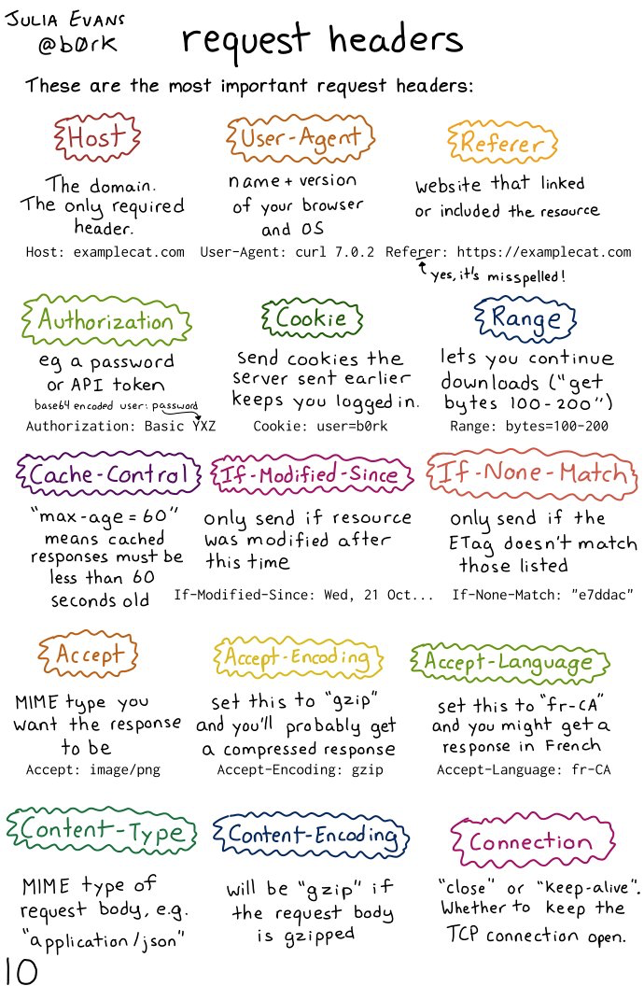

# HTTP

HyperText Text Transfer Protocol.

HTTP is a client-server application layer protocol.

HTTP is a request-response protocol that defines format of messages to be exchanged between web clients and web servers. It is a stateless protocol in which no session information is retained by the server. This means that if a client requests the same object multiple times in a row, the serve would send it and would not know that the same client is requesting the same object repeatedly.

---




---

“Payload” = part of transmitted data that is the actual intended message.

# **Types of HTTP connections**

- Non-persistent HTTP connections
    1. The client initiates a TCP connection with a server.
    2. The client sends an HTTP request to the server.
    3. The server retrieves the requested resource from its storage etc. and sends it back to the client.
    4. THe client receives the resource, say an HTML. If that file has references to more resources, steps 1-4 are repeated for each of those.
    5. The server closes the TCP connection.
- Persistent HTTP connections
    
    Because an HTTP session typically involves multiple non-persistent HTTP connections, the TCP connections which are established and torn down multiple times are inefficient. Persistent HTTP connections are developed such that the duration of the time before the server closes the connection is configurable. Hence, only 1 TCP connection is used to serve multiple requests.
    

# **HTTP session**

An HTTP session is a sequence of network request-response transactions.

1. An HTTP client initiates a request by establishing a TCP connection to a particular port on the HTTP server.
2. The HTTP server listening on that port waits for a client’s request message.
3. Upon receiving the request, the server sends back a status line and a message.

# **HTTP messages**

**HTTP messages are in plain ASCII text**

- Request
    
    ```
    GET /index.html HTTP/1.1    Request line (method, URL, version)
    Host: www.google.com        Header line
    Connection: keep-alive      Header line
    User-Agent: Mozilla/5.0     Header line
    Accept-language: fr.        Header line
    Accept: text/html           Header line
    \r\n
    
    Other headers:
    Cookie: value
    ```
    
- Response
    
    ```
    HTTP/1.1 200 OK             Status
    Connection: close           Header line
    Date: Tue, 18 Aug 2020 ...  Header line (date of response)
    Server: www.google.com      Header line
    Last-Modified: ...          Header line (date object last mod)
    Content-Length: 16824       Header line (bytes)
    Content-Type: text/html     Header line
    \n
    <binary data>               Object
    
    Other headers:
    Set-cookie: value
    ```
    

- Route/path
- query parameter
- Body
    - JSON
    - Form fields
        - 
- Header

## Content types (encoding)

`application/x-www-form-urlencoded` (POST)

Normal

```
POST /test HTTP/1.1
Host: foo.example
Content-Type: application/x-www-form-urlencoded
Content-Length: 27

field1=value1&field2=value2
```

`multipart/form-data` (POST)

When there are files

```
POST /test HTTP/1.1 
Host: foo.example
Content-Type: multipart/form-data;boundary="boundary" 

--boundary 
Content-Disposition: form-data; name="field1" 

value1 
--boundary 
Content-Disposition: form-data; name="field2"; filename="example.txt" 

value2
--boundary--
```

`text/plain` (POST)

# HTTP methods

- GET - fetch an existing resource
- POST - create a new resource
- HEAD - fetch HTTP headers sent
- DELETE - delete an existing resource
- PUT - update an existing resource
- OPTIONS
    
    ```bash
    curl -X OPTIONS https://google.com -i
    ```
    
    - Identify allowed request methods (eg. GET etc.). Response contains an `Allow` header.
    - Preflighted requests in CORS

# HTTP headers

(basic)

- **Date**: Sat, 03 Jul 2021 07:23:23 GMT
- **Server**: nginx
- **Content-Length**: 1125
    
    Entity's body size (bytes)
    
- **Content-Type**: text/html; charset=utf-8
    
    Resource's media type
    

(security)

- **Strict-Transport-Security**: max-age=31536000; includeSubDomains
    
    Tell a browser you should only load the website in HTTPS. Here is one year.
    
- **Content-Security-Policy**: ****default-src 'self'; ****style-src 'self'; ****script-src 'self'; object-src 'self'; connect-src 'self'; frame-src 'self'; image-src 'self'
    
    Whether to load assets (eg. documents, CSS, images, JavaScript)
    
    <aside>
    🚨 XSS, data injection
    
    </aside>
    
    https://report-uri.com/home/analyse/
    
    There's a **Content-Security-Policy-Report-Only** header for debugging purposes.
    
- **X-Frame-Options**: {DENY, SAMEORIGIN, ALLOW-FROM https://example.com}
    
    Whether to allow your website to be *framed* or not.
    
    <aside>
    🚨 Clickjacking
    
    </aside>
    
- **X-Content-Type-Options**: nosniff
    
    Whether the browser can *MIME-sniff* the resource. MIME-sniffing happens (for some web browsers) to determine the content of an asset. Specific to IE and Chrome. With clever naming, a resource can be determined to be an HTML document which has malicious script.
    
    <aside>
    🚨 XSS
    
    </aside>
    
- **Referrer-Policy**: no-referrer
    
    Tell the browser how much information to put in this header when navigating away from the document.
    
    <aside>
    🚨 Privacy
    
    </aside>
    

(new)

- **X-Processing-Time:** 0.061

[https://securityheaders.com](https://securityheaders.com/)
