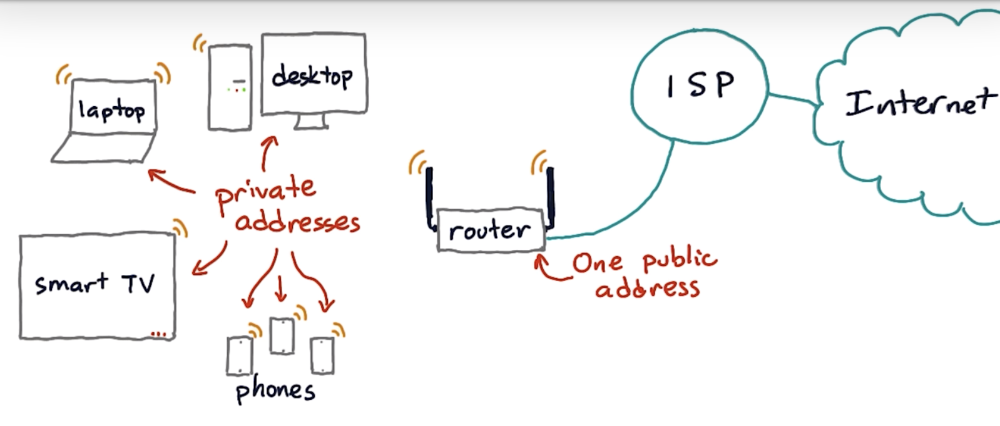

# IP

**Internet Protocol**

To be able to use the underlying data link technologies

# **Assumptions**

- To provide unreliable connectionless services
- IP hosts must have fixed size 32-bit addresses
- IP must be compatible with a variety of data link layers
- IP hosts should be able to exchange variable-length packets

# **IP addresses**

32-bit numbers written as 4 bytes. Eg. 1.2.3.4 corresponds to 00000001000000100000001100000100.

# **Multihoming**

A router has as many IPv4 addresses as the number of interfaces it has in the data link later. These hosts are said to be multihomed.

# **Address classes**

| Class | Length of subnet ID | Range | Default subnet mask | Remarks |
| --- | --- | --- | --- | --- |
| Class A | 1 octet | 0.0.0.0 to 127.255.255.255 | 255.0.0.0 |  |
| Class B | 2 octets | 128.0.0.0 to 191.255.255.255 | 255.255.0.0 |  |
| Class C | 3 Octets | 192.0.0.0 to 223.255.255.255 | 255.255.255.0 |  |
| Class D |  |  |  | For multicast |
| Class E |  |  |  | Reserved |

# **Subnetting**

- Subnetting based on octets (deprecated).
- Variable-length subnetting.

| Subnet | No. of possible addresses | Lowest address | Highest address |
| --- | --- | --- | --- |
| 10.0.0.0/30 | 2^2 | 10.0.0.0 | 10.0.0.3 |
| 192.0.2.0/24 | 2^8 | 192.0.2.0 | 192.0.2.255 |

# **Address assignment using subnetting**

- Subnet mask: host bits set to 0
eg. 203.128.22.0 and a host can be 203.128.22.7
- Network address: host bits set to 0
eg. 203.128.22.0.
- Broadcast address: host bits set to 255 (all binary 1’s)
eg. 203.128.22.255
- Host address: host bits
eg. 203.128.22.18

# **Special addresses**

**Self-identification**

0.0.0.0/8

**Loopback address**

127.0.0.1/8

Each IPv4 host has a loopback interface that is not attached to a data link layer. This allows processes running on a host to use TCP/IP to contact other processes running on the same host. This is very useful for testing purposes.

**Private addresses**

10.0.0.0/8, 172.16.0.0/12, 192.168.0.0/16

Private networks that are not directly attached to the Internet.

**Link-local address**

169.254.0.0/16

# **Routing**

Routing is done via a routing table and longest prefix match.

# **Interfaces**

Hosts (computers) don’t have IP addresses. Interfaces on hosts have IP addresses.

Interfaces

- Ethernet interface
- Wifi interface
- Loopback interface
- Tunnel interface
- Virtual machine interface

# **IPv4 packet header**

- Version
- Length
- Source address
- Destination address
- Protocol
    - Protocol “1” is ICMP.
- Checksum
- Flags
- TTL
- IP data (payload)

# **Fragmentation and reassembly**

IPv4 packets need to be fragmented depending on the data link layer’s maximum transmission capability. They can be as big as 64KB.

# **NAT (Network Address Translation)**

Router is a device that connects two different IP networks.

