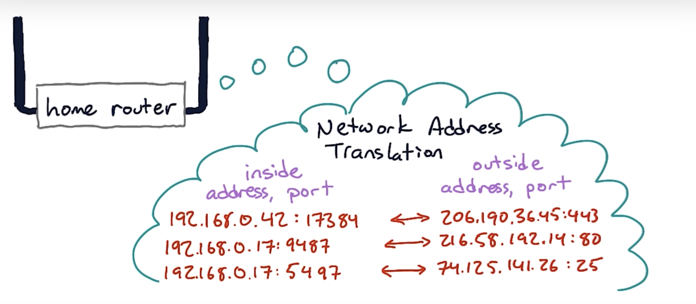

# Routing

The process of selecting a path for traffic in a network / between networks / across multiple networks

Routing is done via a routing table and longest prefix match.

Routing protocols

- Static: manually compute routes
- Dynamic

## **NAT (Network Address Translation)**
    
**A NAT allows all of the hosts of a router share one or a few public IPv4 addresses (usually between private and public).** This is to deal with shortage of IPv4 addresses. What it does is to modify the IP addresses in the IP header.

Router is a device that connects two different IP networks.

# **Routing table**

