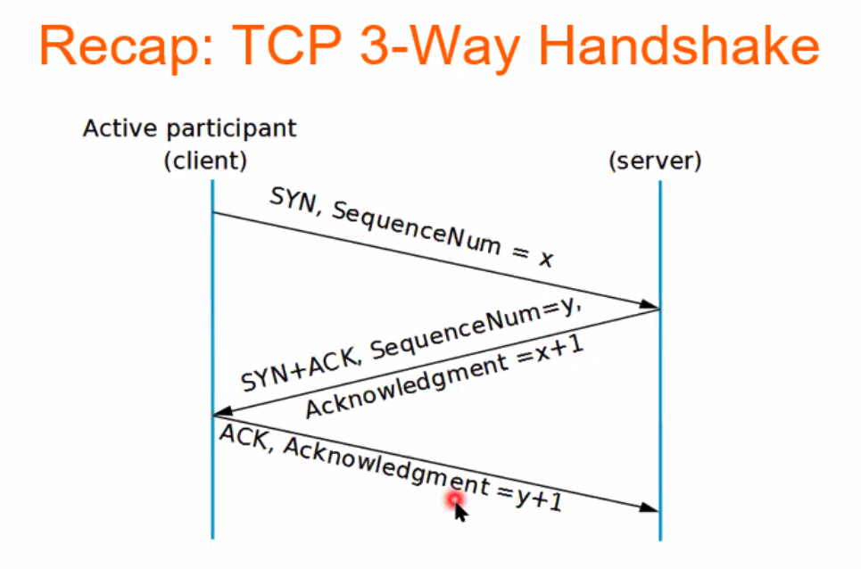
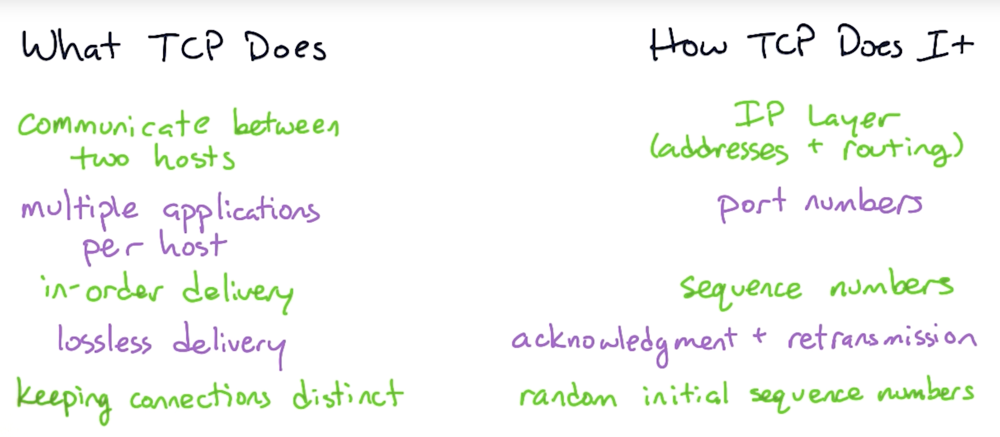

# TCP

Transport Control Protocol

TCP is a connection-oriented protocol. It is full-duplex (both hosts on a TCP connection can send messages to each other simultaneously).

~~~admonish tip title="Analogy"
What if you **can't understand** what your friend is saying?
- Should you ask them to **repeat what they said**?

What if you haven’t **heard them speak for a while**?
- Does your friend simply **not have anything to say?**
- Has the phone lost reception and **disconnected?**
- Should you **keep talking?** If so, **for how long**?
- Should both you and your friend periodically say “mhmm” to indicate that you are present and listening?
~~~

TCP: “You, Packet 243, you first. You, Packet 132, you next.”

TCP:

```kotlin
client ----syn------> server
       <----syn+ack--
       ----ack------>
```

## 3-way TCP handshake 

1. Client sends a TCP segment with SYN flag & …
2. Server replies a TCP segment with SYN and ACK flag & …
3. Client sends an ACK flag & …


## How it works

Ensures that messages are always (i) delivered (ii) in the correct order. TCP: ensures data reaches the intended destination and data is not corrupted.

- Accept data from a data stream
- Divide into segments
- Identify and retransmit messages accordingly
- Reassemble messages if out of order

**TCP packet**

Consists of:

- Ethernet or wifi header
- IP header
- TCP header
    - Source port number
    - Destination port number
    - Sequence number
    - Acknowledgement number
    - Header length
    - …
    - Flag (synchronise, finish, push, reset, acknowledge, urgent)
    - Window size
    - Checksum
    - Urgent pointer
    - …
- Data (payload)


