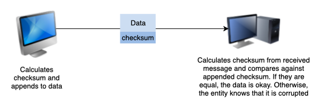
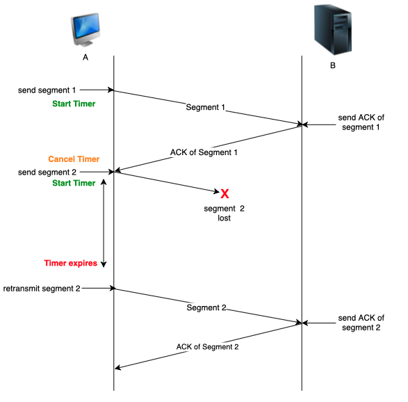

# Layer 4 - Transport

TCP: “You, Packet 243, you first. You, Packet 132, you next.”

TCP:

```kotlin
client ----syn------> server
       <----syn+ack--
       ----ack------>
```

# Transport layer

**What are involved?**

End-system’s OS kernel, system libraries

**Responsibilities**

- Provides a layer of abstraction for application-to-application delivery
- Segments the data
- Allows multiple conversations to occur at once
- Multiplexes and demultiplexes data
- Correctness of data

Connection-oriented protocol

# **Sockets**

Sockets are gateways between applications and the network. Data is sent from application to socket. Sockets have an associated port number with them.

OS can take care of explicitly specifying a port. THis is called ephemeral ports, i.e.e OS will bind a socket to a port dynamically

# **Multiplexing and demultiplexing**

Transport layer labels packets with the port number of the application a message is from and the one it is addressed to. This allows the layer to multiplex and demultiplex the data. TCP and UDP implement these differently.

# **Congestion**

When more packets than the network has bandwidth for are sent through, some packets get dropped and some get delayed. Here are some fixes:

- Send packets at a slower rate in response to congestion
- Track changes in traffic

# **Principles of congestion control**

- Bandwidth allocation
    
    Bandwidth is allocated per connection. A host can open multiple connections. Bandwidth cannot be divided and allocated equally among end-systems because real traffic is transmitted in bursts and not in one continuous stream.
    
- Fairness
    
    Increasing the transmission rate. Of one end-system necessarily decreases another.
    
- Convergence
    
    Bandwidth should be allocated such that no one host hogs all of it.
    

# **Principles of reliable data transfer**

| Corrupted segments | Use checksum. Discard if invalid. |
| --- | --- |
| Lost segments | Use retransmission timer*. |
| Duplicated or reordered segments | Use sequence numbers |

*TCP sends an acknowledgement for almost every segment





**Pipelining using the sliding/sending window**

Method to wait for the acknowledgement of every transmitted message before sending another one. Go-back-n and selective repeat protocols ensure detection and retransmission of lost packets.

# **Terminologies**

Rount trip time: time taken to send packet and get acknowledgement

Bandwidth: rate at which the newtwrok can transport bits

Throughput: amount of data that is actually transferred
