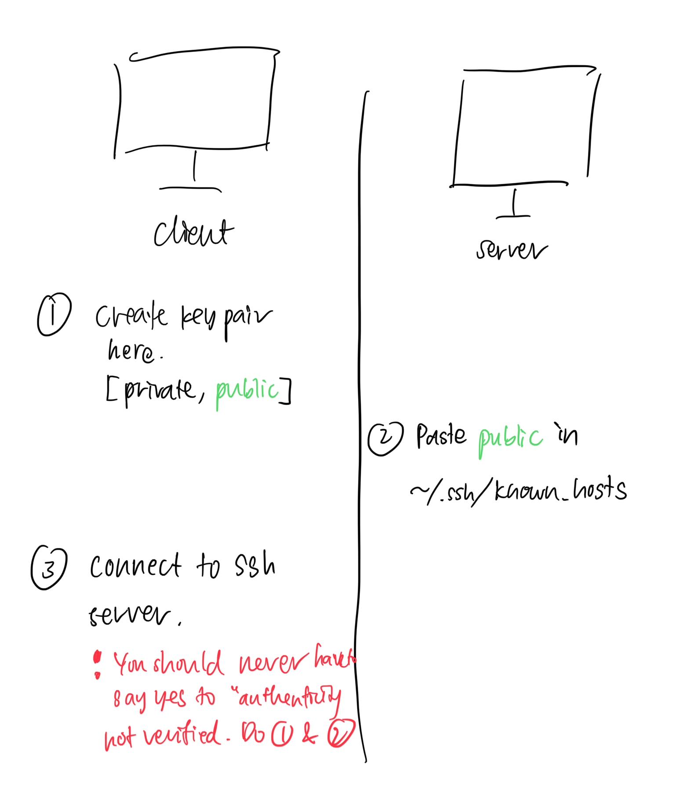

# SSH

Secure Shell

SSH is built on top of TCP.

This protocol provides a secure way to access a remote computer via shell.

~~~admonish hint title="SSH as an authentication mechanism"
In some applications like GitHub and databases, the authentication parts of the SSH workflow (everything before the accessing of the remote shell) is used to authenticate the client with the server.
~~~

## Workflow

2 asymmetric keys used:
1. key pair 1 (ephemeral; server: private key)
2. key pair 2 (client: private key)

bla

1. **Client begins TCP handshake** 
    
2. **Set up session key (shared key)**
    
    Ephemeral key pair 1 used to set up symmetrical encryption. Server gives the client the public key. Diffie-Hellman algorithm is used here.
    
3. **Client authenticates**
    
    Use key pair 2 which has been generated previously. To authenticate, server uses public key 2 to encrypt some message. Client proves that it can decrypt using private key 2.
    
    Client calculates a hash which is a function of the decrypted message and other metadata, then sends to server.
    
    Server compares with its own calculation of hash (which should be the same).
    
    Some authentication methods:
    
    - RSA
    - ECDSA
    - Ed25519
4. **Client accesses remote shell**
    
    Not for Git, this part is not used. git clone command using SSH only involves establishing a secure connection between the client and server.
    

Authenticate using one of the following:

- Password
- Private key
- SSH certificates

~~~admonish note title="SSH implementations"
* OpenSSH (macOS)
* PuTTY (Windows, Linux)
~~~
