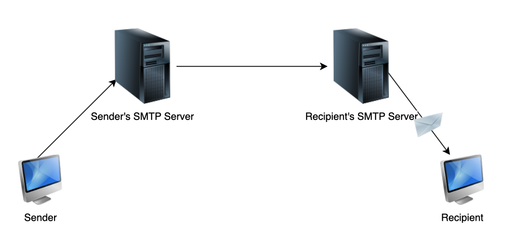

# SMTP

Simple Mail Transfer Protocol (Sending Mail To People)

SMTP is a push protocol, used to send email out to the SMTP server whenever it needs to. SMTP uses TCP, which means that transfers are reliable. Connection is established at port 25.

1. Email is sent to sender’s SMTP server.
2. Email is now placed on a message queue in the sending SMTP server.
3. Sender’s SMTP initiates a connection with the recipient’s SMTP server an will conduct an initial SMTP handshake.
4. Sender’s SMTP  the email to recipient’s SMTP server.
    
    sends
    
5. Using a pull protocol, email is then downloaded from the recipient’s SMTP server.



# **Format**

Note: All SMTP email messages are in 7-bit ASCII

```
Delivered-To: user@gmail.com
Date: Thu, 16 May 2019 03:36:28 +0000 (UTC)
From: Fahim from Educative <fahim+newsletter@educative.io>
Mime-Version: 1.0
Reply-to: fahim@educative.io
Subject: Data analysis with R
To: user@gmail.com
 
Content-Transfer-Encoding: quoted-printable
Content-Type: text/plain; charset=UTF-8
Mime-Version: 1.0
 
Hey User,
 
Regards,
Raimi
```
