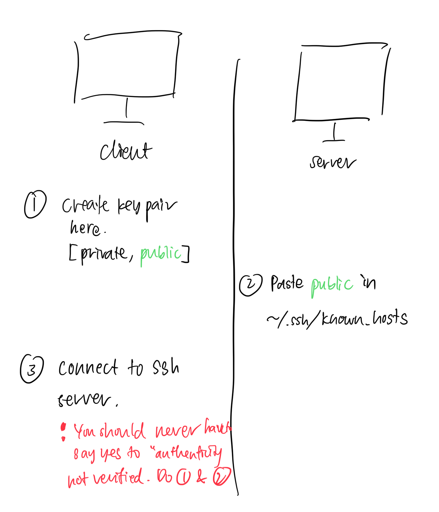

# SSH

SSH implementations:
* OpenSSH (macOS)
* PuTTY (Windows, Linux)

https://robotmoon.com/ssh-tunnels/

2 asymmetric keys used — key pair 1 (ephemeral; server: private key) & key pair 2 (client: private key)

1. **Client begins TCP handshake** 
    
    (SSH is built on top of TCP)
    
2. **Set up session key (shared key)**
    
    Ephemeral key pair 1 used to set up symmetrical encryption. Server gives the client the public key. Diffie-Hellman algorithm is used here.
    
3. **Client authenticates**
    
    Use key pair 2 which has been generated previously. To authenticate, server uses public key 2 to encrypt some message. Client proves that it can decrypt using private key 2.
    
    Client calculates a hash which is a function of the decrypted message and other metadata, then sends to server.
    
    Server compares with its own calculation of hash (which should be the same).
    
    Some authentication methods:
    
    - RSA
    - ECDSA
    - Ed25519
4. **Client accesses remote shell**
    
    Not for Git, this part is not used. git clone command using SSH only involves establishing a secure connection between the client and server.
    

Secure shell

Cryptographic protocol to allow a secure connection to a remote host over an unsecured network.

Authenticate using one of the following:

- Password
- Private key
- SSH certificates

**SSH (Secure Shell)**

Cryptographic network protocol that provides administrators with a secure way to access a remote computer. SSH also refers to the suite of utilities that implement the protocol. Secure Shell provides strong authentication and secure encrypted data communications between two computers connecting over an insecure network such as the Internet. SSH is widely used by network administrators for managing systems and applications remotely, allowing them to log in to another computer over a network, execute commands and move files from one computer to another.

# Workflow

# SSH port forwarding / SSH tunnel

- Local
- Remote

