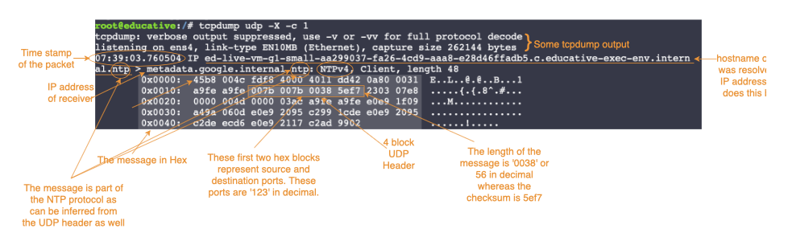

# Troubleshooting

## Quicks

`netstat` see open ports

## Transport layer

```
sudo lsof     list files and processes
    -i        list only network sockets
    -i:8080   at port 8080
    -t        show only process ID
    -P        show port
```

View UDP packets

```
tcpdump [udp]
    -c 10            capture 10 packets
    -w output.pcap   write to a file
    -r output.pcap   read a file
    -X               print hex and ASCII
```




Capture packets on en0 interface

```
sudo tcpdump -i [en0|lo0]
```

Capture packets that are to or from my computer

```
sudo tcpdump -p

sudo tcpdump [...] [and|or] [...]
    [src|dest|tcp] port <port-no>
    host <IP-addr>
```

Make TCP connections: chat server

```
{
    nc -l 3456
}
{
    nc localhost 3456
}
```

Make tcp connections: file server

```
{
    nc -l 4444 > myfile.txt
}
{
    echo "hiiii" > thefile.txt
    nc localhost 4444 < thefile.txt
}
```

Netcat

```
nc 
    en.wikipedia.org 80 other args 
    localhost 3456         client
    -l 3456                listen on port 3456
    -l 3456 | /bin/bash    listen on port 3456
    -z localhost 3456-3457 port scanning from 3456 to 3457
    -lU /var/tmp/dsocket   create a listening stream socket
    -U /var/tmp/dsocket    connect to an existing stream socket
    -v verbose
```

## Network layer

IP

```
curl ifconfig.me
```

My IP address

```
ipconfig getifaddr en0
```

Find default gateway

```
ip route show default
netstat -nr
route -n get default
```

ICMP: echo request & reply

```
ping 8.8.8.8 send and receive network traffic with this address (‘ping server’)
    -c3 send 3 packets then stop
```


(TTL=no.of hops before being discarded)

Sending ICMP messages

```
traceroute [address]   list hops between host and other host
	-m max TTL
```

```
nmap -sP 192.168.1.0/24
```

```
netstat -pant | grep LISTEN
```

```
curl https://ipvigilante.com/133.237.7.85 | jq
```

```
nc google.com 80
```

See what steps your packet takes to get somewhere

```
traceroute google.com
```
