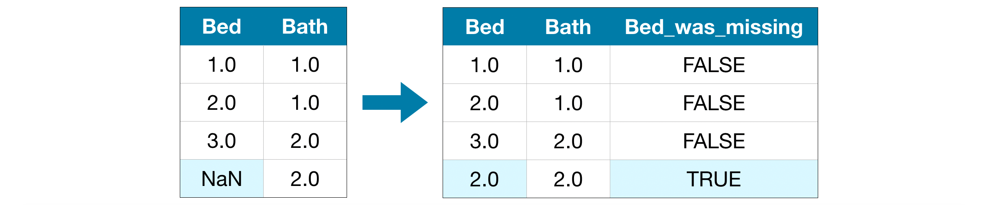

# Feature engineering

Process of extracting features from raw data

- Examples:
    - Feature cross / synthetic feature (formed by crossing two or more features)
    Allows one to learn a non-linearity within a linear model
    - Location vs. distance
    - Timestamp vs. period
    - Polynomial features
    - Unlucky numbers
    - Metadata
    - Domain knowledge

**Missing Values**

1. Drop column/row
2. Impute using mean, median, etc.
    
    
    
3. Extend imputation
    
    
    
4. Use algorithms that support missing values eg. k-NN

> 💡 Missing values can be filled in by looking at the other features that are highly correlated with that column. In pandas, this can be done using a combination of `groupby` and `fillna`. Eg. will be a column called Fare which has some missing values. This column is, say, highly correlated with PassengerClass. One would want to group the passengers into their respective PassengerClass first, then take the median as the fill value. Also, think about it from the perspective of an organisation who set the fare: how do you think they would price a ticket? Usually it's based on 1) age, 2) no. of people travelling with you and 3) the kind of service you chose.

> ⚠️ While dealing with missing values, combine both training and test set. Otherwise filled data may overfit to training or test set samples.

- Normalisation
    
    Normalization scales the features to a 0-1 range.
    
    This is a special case of Min-max scaling.
    
    It is useful when we need the data to be in a bounded interval.
    
- Standardisation
    
    Standardization centers the features at mean 0 with a standard deviation 1.
    
    Which is preferred by many algorithms.
    
    Standardization keeps useful information from outliers.
    

Normalization vs Standardization

- Standardization may be used when data has Gaussian Distribution.

- Normalization is great with Non-Gaussian Distribution

- Impact of Outliers is very high in Normalization

[https://twitter.com/fchollet/status/1627818199311069184?s=20](https://twitter.com/fchollet/status/1627818199311069184?s=20)
