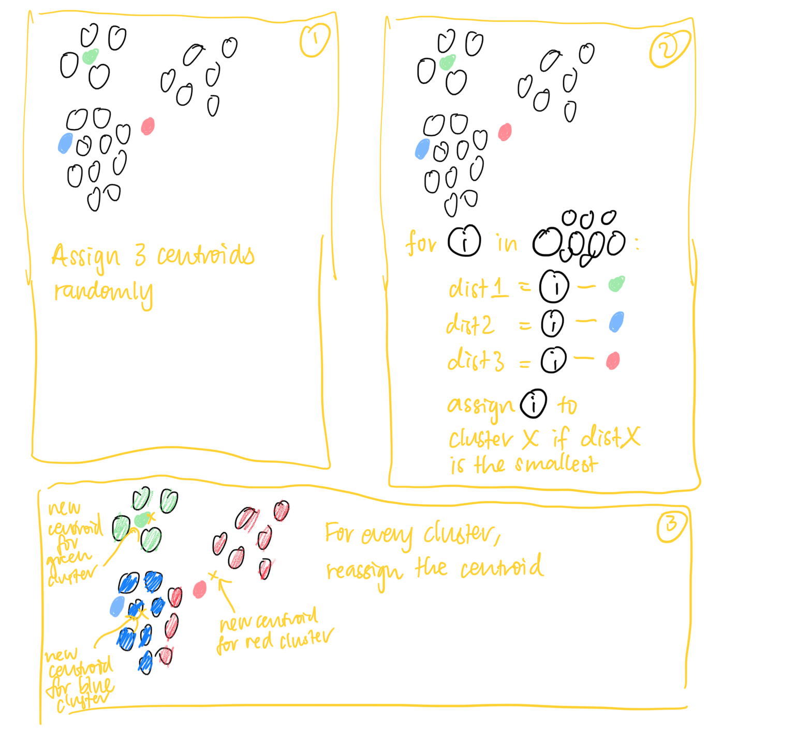

# k-means

**#nonparametric**

Assign k centroids randomly

Get each data point to see which centroid it’s closest to, and assign a class

Calculate centre of points for each group

Reassign the k centroids

Use silhouette heuristic or the elbow method to determine a reasonable value for k

> 💡 Assumes clusters are normally distributed in each dimension

Time $O(m \cdot k \cdot n)$

1. Assign $k$ centroids
2. For every datapoint, calculate distance to all other centroids — $O(k)$
3. Repeat for all datapoints — $O(n)$
4. Reassign each datapoint to the nearest cluster
5. Repeat for $m$ iterations until convergence — $O(m)$

Space $O(n)$
