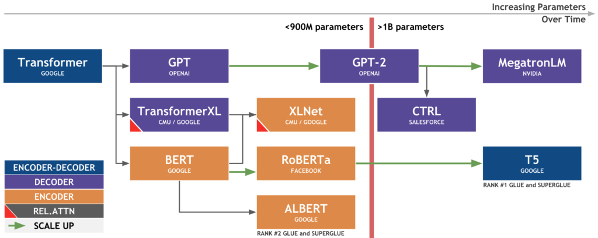

# Language modelling

Difference between encoder and language model is that encoders output a vector whereas LMs output a sequence of tokens. 

[https://web.stanford.edu/class/cs124/lec/languagemodeling.pdf](https://web.stanford.edu/class/cs124/lec/languagemodeling.pdf)

[https://lilianweng.github.io/lil-log/2019/01/31/generalized-language-models.html](https://lilianweng.github.io/lil-log/2019/01/31/generalized-language-models.html#gpt-2)

[https://syncedreview.com/2017/09/10/language-model-a-survey-of-the-state-of-the-art-technology/](https://syncedreview.com/2017/09/10/language-model-a-survey-of-the-state-of-the-art-technology/)

---

<!-- toc -->

---

# Why model language?

Natural language is not deterministic unlike programming language. This randomness in the sequence of words can be modelled probabilistically. 

# Types of language models

- Statistical language model (count-based)
- Neural language model (continuous-based)

# Statistical language model

## Model

We first fix $n$ to be the length of this sequence of words. A language model is the (joint) probability distribution over a sequence of words

$$
p(w_1, w_2, ..., w_n)
$$

where $w$ is any word available in the language's vocabulary and $\theta$ are the parameters of the model and which can be conveniently broken down into

$$
p(w_n|w_{n-1}, w_{n-2}, ...,w_1) \times ... \times p(w_3|w_2,w_1) \times p(w_2|w_1) \times p(w_1) =\prod_i p(w_i|w_{i-1}, ..., w_1)
$$

or (for better readability)

$$
p(w_1) \times p(w_2|w_1) \times p(w_3|w_2,w_1) \times ... \times p(w_n|w_{n-1}, w_{n-2}, ...,w_1)
$$

The way we model language is that the choice of the next word ("**next-word prediction**") depends on the previous words which have said ("realise").

Now let's compute the joint probability 

$$
p(\text{its}, \text{water}, \text{is}, \text{so}, \text{transparent}, \text{that})
$$

or rather let's try to predict the next word, say finding out if the next word is the:

$$
p(\text{the} | \text{its}, \text{water}, \text{is}, \text{so}, \text{transparent}, \text{that})
$$

which equals to (by Bayes):

$$
\frac{
p(\text{its}, \text{water}, \text{is}, \text{so}, \text{transparent}, \text{that}, \text{the})
}{p(\text{its}, \text{water}, \text{is}, \text{so}, \text{transparent}, \text{that})}
$$

We could take the counts based on our data:

$$
\frac{
Count(\text{its}, \text{water}, \text{is}, \text{so}, \text{transparent}, \text{that}, \text{the})
}{Count(\text{its}, \text{water}, \text{is}, \text{so}, \text{transparent}, \text{that})}
$$

But this is impossible

<aside>
💡 Why ah? Because if they don't exist in our data, doesn't mean they don't occur naturally.

</aside>

## Markov assumption as approximation

In the $n$-th order Markovian assumption, we assume the next word depends on the last $n$ words.

We simplify the problem to instead find ("**bigram model**")

$$
p(\text{the} |  \text{that})
$$

or ("**trigram model**")

$$
p(\text{the} | \text{transparent}, \text{that})
$$

or

$$
p(\text{the} | \text{so}, \text{transparent}, \text{that})
$$

or to generalise, we simplify the problem to be

$$
p(w_1, w_2, ..., w_n) \approx \prod_i p(w_i|w_{i-k}, w_{i-k-1}, ..., w_{i-1})
$$

where $k$ is the number of preceding words before $w_i$. Another way to look at this is:

$$
p(w_i| w_1, w_2,  ..., w_{i-1}) \approx \prod_i p(w_i|w_{i-k}, w_{i-k-1}, ..., w_{i-1})
$$

The value $k$ then represents if its a unigram model ($k=0$), bigram ($k=1$) or $n$-gram.

## Solution to optimisation problem

A common solution is to use MLE. Below is for a bigram model.

$$
p(w_i|w_{i-1})=\frac{count(w_{i-1}, w_i)}{count(w_{i-1})}
$$

## Tweaks

- Laplace smoothing (for unseen words)

## Problems

- Sparsity
- Curse of dimensionality

# Neural language models

## Model

$$
p(\text{word}|<k \text{ previous words}>, \theta_{model})
$$

## Architectures

- FFNN
- RNN
- Transformers
    
    The key/value/query concepts come from retrieval systems. For example, when you type a query to search for some video on Youtube, the search engine will map your query against a set of keys (video title, description etc.) associated with candidate videos in the database, then present you the best matched videos (values). [Source](https://stats.stackexchange.com/questions/421935/what-exactly-are-keys-queries-and-values-in-attention-mechanisms/424127#424127)
    

# How?

1. Pre-train, framed as a language modelling
    
    Pretraining is usually down on a huge corpus.
    
2. Applying to downstream tasks:
    1. Fine-tune (specialise), framed as predicting conditional probabilities
        - Discriminative tasks
        - Generative tasks
        - Abstractive tasks
    2. Feature-based tasks

## 1. Teach the model the world ("pre-training")

A language model is the statistical model that...

- Native language
    - What's the next word? What are the next words? ("**causal language modelling**" / "**next-token prediction**")
        
        GPT, GPT2, GPT3, CTRL, Transformer-XL, Reformer, XLNet, ProphetNet
        
    - Cloze ("**masked language modelling**"). Predict only the masked words.
        
        BERT
        
    - Can this be the next sentence? What could be the next sentence? ("**next sentence prediction**") (CLM?)
        
        BERT
        
    
    ---
    
    - Were these 2 sentences swapped? If swapped, can I still figure out the context? ("**sentence ordering prediction**")
    - Define what task I want to do, then work on it ("**instructional language modelling**")
        
        CTRL, T5, GPT3?
        
    - Correct my sentence. Which words did I miss out? ("**correctional language modelling**")
    - Summarise the content ("**summarisational**")
        - Mask a span of tokens as a single mask token
        - GSG (Pegasus)
    - Downstream tasks ("**fine-tuning**")
    
    ---
    
    - Which words were replaced? Which words are "natural" to you? ("**adversarial language modelling**")
    - Learning with images and sounds etc. ("**multimodal**")
    - Understanding the context
        
        XLNet
        
    - Reading / understanding *long* texts ("**high attention**")
        
        Transformer-XL, Longformer
        
    - Factual language modelling
- Learning a new language ("**cross-language modelling**" / "**translation language modelling**")
    - (SentenceInLanguageA, SentenceInLanguageB)
    

What is the model built for?

- Generate only (decoder? only, autoregressive). Eg. generate text
- Understand (autoencoder) and possibly use it for something useful next time. Eg. Sentence classification.
- Understand and generate (sequence-to-sequence). Eg. translation, summarisation

Data sources:

Common sources are Wikipedia, web news, web question-answer pages and discussion forums.

## 2. Applying / Fine-tune / datasets / downstream tasks / see how well you trained the model

(SuperGLUE tasks)

- Discriminative tasks
    
    Grammar
    
    - CoLA (GLUE)
    
    Sentiment analysis
    
    - SST-2 (GLUE)
- Generative tasks
    - Summarisation
        - ELI5
        - XSum
        - ConvAI2
        - CNN/DM
- Unclassified
    - Sentence similarity / paraphrase
        - STS-B (GLUE)
        - QQP (GLUE)
    - Question answering
        - SQuAD
        - QNLI (GLUE)
    - Textual entailment
        - MNLI (GLUE)
    - Translation
        - WMT

Speed

Reformer

- Continual learning
- Understanding the context first (dual encoder, one decoder)
- Lack of information (data)

- Causal language modelling
    
    AKA next-word prediction, next-token prediction
    
- Mask language modelling
    1. Randomly mask 15% of input tokens
    2. Model to predict the masked tokens
- Next-sentence prediction
    
    Ever example is a tuple of
    
    ((Sentence A, Sentence B), B is next | B is not next)
    

[https://huggingface.co/transformers/model_summary.html](https://huggingface.co/transformers/model_summary.html)

This categorisation is based on the question "how do you train/teach these models?" Note that it does not mean that they do not share the same architecture.

# Types of fine tuning

[https://ruder.io/recent-advances-lm-fine-tuning/](https://ruder.io/recent-advances-lm-fine-tuning/)

- **Adaptive fine-tuning** — specialise to target domain
    1. Pre-training
    2. Adaptive fine-tuning on target data
    3. Fine-tuning on task labels
- **Behavioural fine-tuning** — specialise to target task
    1. Pre-training
    2. Behavioural fine-tuning on relevant tasks
    3. Fine-tuning on task labels
- **Parameter-efficient fine-tuning** — reduce model size
- **Text-to-text fine-tuning** — ?

# What did we learn?

- Pretraining, then fine tuning
- MLM
- More data is good
