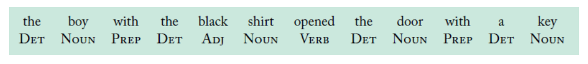
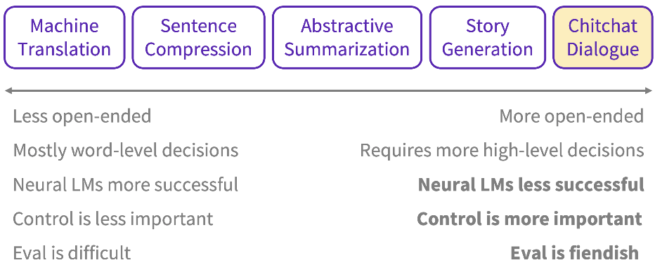

# Language

<!-- toc -->

---

[http://nlpprogress.com/](http://nlpprogress.com/)

The field of designing methods and algorithms that take as input or produce as output unstructured human language.

Some characteristics of natural language are

- discrete / symbolic
- compositional
    - letters form words, words form phrases and sentences, sentences form documents

# Vocabulary

**Zero-shot** — follow instructions

**Few-shot** — learn in-context; in-context learning

Context = neighbouring words

Semantic = what this set of letters mean

Syntax = where does a word occur in a sentence, in relation to other words, related to grammar (conjugation, pluralise)

Vocabulary size = no. of unique words

Tokens = no. of words

Pivot word = current word

Context-dependent aspects of word meaning

Downstream task = supervised learning tasks that utilise a pre-trained model or component

Vocabulary size

Sequence length

Semantic questions:

- capital & country
- currency & country
- city & state
- man & woman

Syntax questions:

- adjective to adverb
- opposite >???
- comparative
- superlative
- present participle
- nationality adjective
- past tense
- plural nouns
- plural verbs

# Concepts

Ideas

- Language modelling
    - predict-the-next-word (vanilla)
    - cloze task (masked language modelling)
    - next-sentence prediction (next sentence prediction)
    - ?? cloze task with permutations ?? (permutation language modelling)
- Modelling: architecture
    - RNN
    - Transformer
    - Autoregressive (sequential)
    - Decoder + encoder (autoencoder)
    - Bidirection
    - Sequence-to-sequence
- Modelling: components
    - Self-attention
- Modelling: algorithms (?)
    - Teacher forcing
        
        
        

# **Tasks / applications**

- Level 1
    - POS tagging
        
        
        
    - Constituency parsing
        
        Break down a text into sub-phrases
        
        
        
    - Dependency parsing
        
        Analyses the grammatical structure of a sentence, starting with the root. The word that has no dependency is called the root of the sentence. The verb is taken as the root of the sentence in most cases.
        
        
        
    - Semantic role labeling
        
        Semantic role labelling assigns labels to words/phrases to indicate their semantic role in the sentence. Eg. "agent", "patient", "instrument", "manner".
        
        
        
    - Coreference resolution
        
        Keep track of entities
        

---

- Level 2
    - Text classification
    - Sentiment analysis
        
        Classify emotions (positive or negative)
        
    - NER
        
        Identify *named* entities (eg. people, location, organisation, number, product)
        
    - **Language modelling**
    - Semantic similarity
    - Text generation
    - Topic modelling
    - Keyword extraction
    - Event extraction
    - Relation extraction
    - Information extraction
        
        Extracting structured information from unstructured data. Over the years, this task has been broken down into NER, coreference resolution, entity linking, relation extraction, even extraction etc.
        

---

- Level 3
    - Summarisation
    - Machine translation
    - Open IE
        
        [https://openie.allenai.org](https://openie.allenai.org/)
        
        Open Information Extraction. "Open" means any kind of relationships. This is in contrast to relation extraction where the relations do not need to be specified in advance.
        
        ```
        Born in a small town, she took the midnight train going anywhere.
        ```
        
        - (**born**, she, in a small town)
        - (**took**, she, the midnight train going anywhere)
        - (**going**, the might train, anywhere)
        
        > 💡 Why do we need this? The ability to glean facts and opinions from sentences.
        
    - Textual entailment
        
        aka NLI (natural language inference)
        
        Whether Sentence A (“**premise**”) can be implied or contradicted by Sentence B (“**hypothesis**”)
        
        (SentenceA, SentenceB) → Entailment | Contradiction | Neutral
        
        > 💡 This problem is often considered an important test for the reasoning skills of ML systems
        
    - QA
        
        AKA machine comprehension. QA answers natural language questions by selecting an answer span within an evidence text.
        
        **Types of machine comprehension**
        
        - Open-domain vs. closed-domain
        - Abstractive vs. Extractive
        - Factoid vs. Non-Factoid
    - VQA
        
        Visual question answering
        
        [https://visualqa.org](https://visualqa.org/)
        
    - Image captioning
    - Chitchat dialogue
    - Paraphrasing

---



# **Frameworks**

- fairseq
- [Stanford](https://nlp.stanford.edu/software/lex-parser.shtml#Download)
- spacy.io
- [https://explosion.ai/demos/displacy-ent](https://explosion.ai/demos/displacy-ent)
- Neuralcoref
- [https://fasttext.cc](https://fasttext.cc/)
- [allennlp.org](http://allennlp.org/)
- NLTK
- gensim
- TensorFlow
- Universal Language Model Fine-tuning (ULMFiT) for trf learning
- [https://github.com/deepset-ai/FARM](https://github.com/deepset-ai/FARM)
- [https://github.com/OpenNMT/OpenNMT-tf](https://github.com/OpenNMT/OpenNMT-tf)
- [https://github.com/huggingface/transformers](https://github.com/huggingface/transformers)
- [huggingface / transformers](https://github.com/huggingface/transformers)
- compromise.cool
- [ONNXT5](https://github.com/abelriboulot/onnxt5) inference-ready
    
    `question: ... ? context: ...`
    
    `summarize: ...`
    
    `translate english to french: ...`
    
- [https://www.sbert.net/index.html](https://www.sbert.net/index.html)

# **Benchmarks**

GLUE score (General Language Understanding Evaluation)

ROUGE (recall-oriented understudy for gisting evaluation)

SuperGLUE

XGLUE
