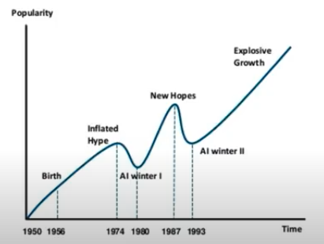

# Limitations and new frontiers

### **Neural networks only accept certain input types**

Effect:

- Difficult to encode structure and prior knowledge

Frontiers:

- 2D spatial structure like images - CNN.
- Graph data like social networks, internet traffic, state machines, mobility & transport, molecules, biological networks - graph convolutional networks.
- 3D data (point clouds: unordered sets with spatial dependence between points) - CNN.

### **Neural networks are excellent function approximators**

Effect:

- Poor generalisation, memorises data. Does not work on unseen data.
- Easily fooled by adversarial attacks (image + perturbation = ???).

Frontiers:

- (See below on uncertainty)

### **Neural network predictions are point predictions**

Effect:

- Cannot quantify uncertainty for unseen data.

Frontiers:

- Bayesian deep learning for uncertainty. Rather then learning the weights directly, we learn a posterior over the weights i.e. P(W|X,Y). This posterior is intractable, however.
- Ensembling for uncertainty estimation.
- Evidential deep learning: directly learn the underlying uncertainty using evidential distributions.
- Multi-task learning using uncertainty

### **Neural networks are large**

Effect:

- Data hungry
- Computationally intensive

### **Neural networks are complex**

Effect:

- Requires expert knowledge to design and fine tune
- Finicky to optimise: non-convex, choice of architecture, learning parameters
- Uninterpretable

Frontiers:

- Automated machine learning for NAS.