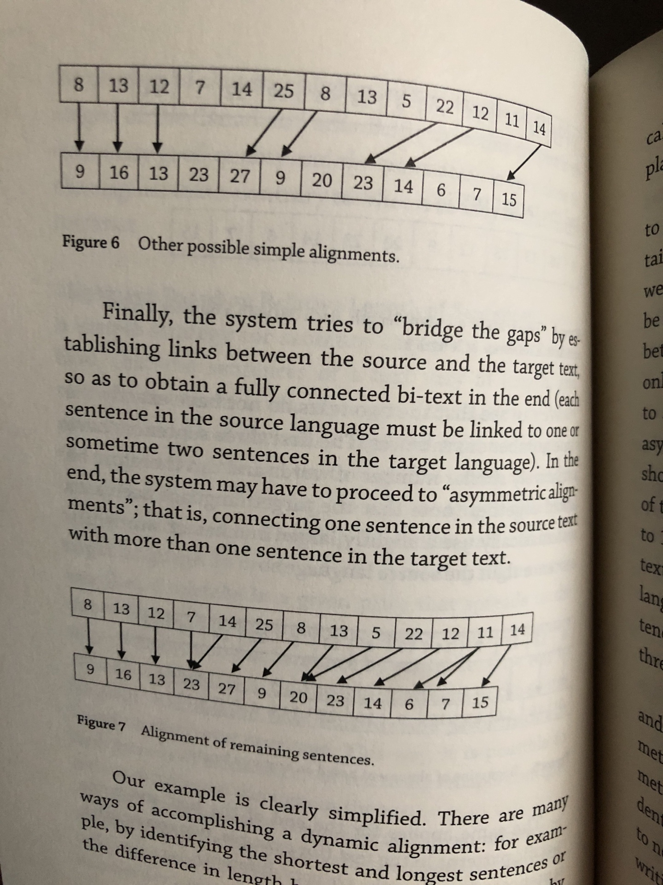
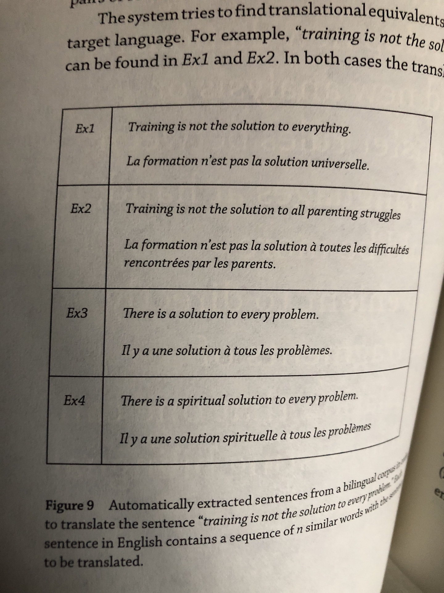

# Machine translation

# Terminologies

Source language

Target language

parallel corpus / bi texts - a pair of texts such that one is a translation of the other

Deceptive cognates

Syntactic duplicates

Morphology - analysis of structure of words

Syntax - analysis of structure of sentence

Syntactic analysis - an analysis of the relative grammatical function of different words in the sentence

Lemma - dictionary form

Word sense - no of meanings per word

“Stemming” - get pseudo roots (Porter stemming, 1980)

pivot language - an intermediate natural language

interlingua - an artificial language with abstract representation

polysemy - coexistence of many possible meanings for a word/phrase

sentence alignment

# Theories

- Meaning is not formally defined but corresponds to the way words are used
- It should respect the main characteristics of the original text, the tone and style, details of its ideas, overall structure

# Examples

The chicken is ready to eat

There was not a single man at the party

# History

Rule-Based

- direct translation system
- transfer system
- interlingua

1940s - idea of autatic translation

1940s-1960s - advent of computers. naive approaches

1965-1990 nothing afterv alpac report

1990s - Statistical Machine Translation

2014 - Neural Machine Translation

# **Example-based translation**

translation by analogy

translate: training is not the solution to every problem

# **Statistical machine translation**

using word alignment

1. Word-based translation
2. Phrase-based translation
3. Syntax-based translation
4. Hierarchical phrase-based translation

**IBM Model 1**

all initial alignments have equal probability

**IBM Model 2**

take into account relative positions

**IBM Model 3**

take into account 1-n correspondences

**IBM Model 4**

consider moveable parts of a sentence

**IBM Model 5**

higher accuracy due to more complex calculations

# Segment-based machine translation

# Neural machine t**ranslation**

Back translation

Translate from target language to source language

Sentence alignment:

two documents. Align the sentence so that we have sentence-level training examples

## **Models**

- Translation language modelling: MLM pre-training has been extended to the multilingual setting by modifying MLM training to include concatenated translation pairs

1. Seq2seq with attention
2. Transformer
3. Conv Seq2Seq
4. Unsupervised MT
5. LASER, from facebook (multilingual sentence embedding)
6. [MarianMT](https://huggingface.co/transformers/model_doc/marian.html) (1000 models)
7. [XLM](https://github.com/facebookresearch/XLM)

## **Metrics**

BLEU - Bilingual Evaluation Understudy Score: metric for evaluating a generated sentence to a reference sentence.

# **Datasets**

* WMT (Workshop on Statistical Machine Translation)
* OPUS [http://opus.nlpl.eu](http://opus.nlpl.eu/)
* CCMatrix
* CCAligned
