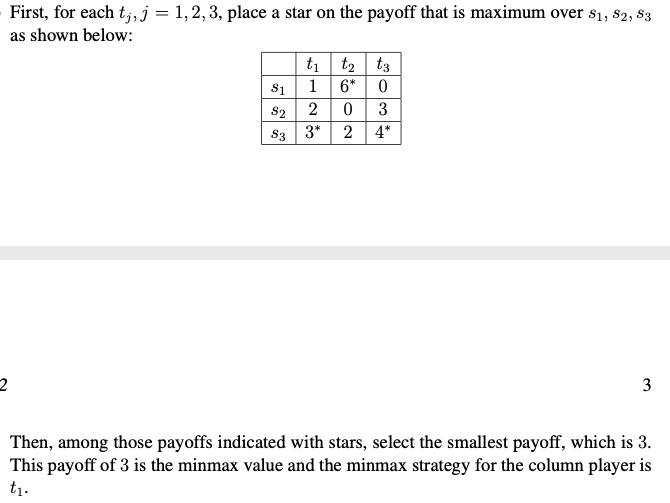

# 2-player zero-sum games

Such games can be classified into:

- imperfect information games
- perfect information games

The sum of the payoffs for any strategy profile is 0. As such, we only need to consider the payoff of one player.

- Pure strategy
    1. For each player, remove pure strategies that are strictly dominated by another pure strategy. Then see if there is a strategy profile left.
        
        > 💡 No Nash equilibrium can involve a strictly dominated strategy. So it should be removed.
        
    2. We adopt a maximin strategy for row and minimax strategy for column player.
        
        > 💡 The maximin strategy is based on the minimax theorem which says that this will result in a Nash equilibrium. It does not matter who goes first ([minimax,maximin] or [maximin, minimax].
        
        Example:
        
        ```
           t1 t2 t3
        s1  1  6  0
        s2  2  0  3
        s3  3  2  4
        ```
        
        1. Use the *maximin* strategy for the row player.
            
            
            
        2. Use the *minimax* strategy for the column player.
            
            
            
- Mixed strategy
    1. For each player, remove pure strategies that are strictly dominated by another pure strategy. Then see if there is a strategy profile left.
        
        > 💡 No Nash equilibrium can involve a strictly dominated strategy. So it should be removed.
        
    2. Recall that we are trying to find the probability distribution for each of the players. Assign a probability of choosing an action for the 2 players with \\( p \\) and \\( q \\) respectively. Find the solution where utilities for selecting every action is the same.
        
        ```
           c1 c2
        r1  1  6
        r3  3  2
        ```
        
        Let \\( p \\) be the probability that \\( r_1,c_? \\) will be played under the mixed strategy \\( s_1,s_2 \\).
        
        $$
        \begin{aligned}
        1p +3(1-p) &= 6p + 2(1-p)\\\\
        p &= \frac{1}{6}\\
        \end{aligned}
        $$
        
        The maxmin strategy is \\( (\frac{1}{6},0,\frac{5}{6}) \\).
        
        Let \\( q \\) be the probability that \\( c_1,r_? \\) will be played under the mixed strategy \\( s_2,s_1 \\).
        
        $$
        \begin{aligned}
        1q + 6(1-q) &= 3q + 2(1-q)\\\\
        q &= \frac{2}{3}\\
        \end{aligned}
        $$
        
        The minmax strategy is \\( (\frac{2}{3},\frac{1}{3},0) \\).
        
        The **value** of this game, using the first row of the matrix and \\( q=\frac{2}{3} \\), is
        
        $$
        1 \times \frac{2}{3} + 6 \times (1-\frac{2}{3})
        $$
