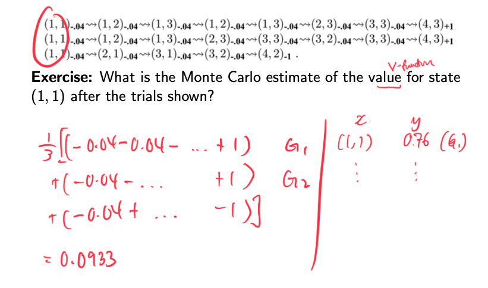

# Direct utility estimation

The Q-value is the mean of rewards across $k$ episodes starting from that state. 

> ⚠️ High variance, estimates might not be accurate

> ⚠️ Must complete episode before learning

$$
\begin{aligned}
U(s) \approx \mu_k 
&= \frac{1}{k} \sum_{i=1}^k \text{sum of rewards in episode } i \text{ starting from }s \\\\
&= \frac{1}{k} \sum_{i=1}^k G_i(s)
\end{aligned}
$$

- Example
    
    
    

Updating when a new episodic return \\( G_k \\) comes in:

$$
U_k(s) = U_{k-1}(s) + \frac{1}{k}[G_k(s) - U_{k-1}(s)]
$$

where:

- \\( U_{k-1} \\) is the estimate after receiving \\( k-1 \\) returns
- \\( G_k \\) is the new data (from initial to terminal state)
- \\( G_k - U_{k-1} \\) can  be considered as the prediction error
