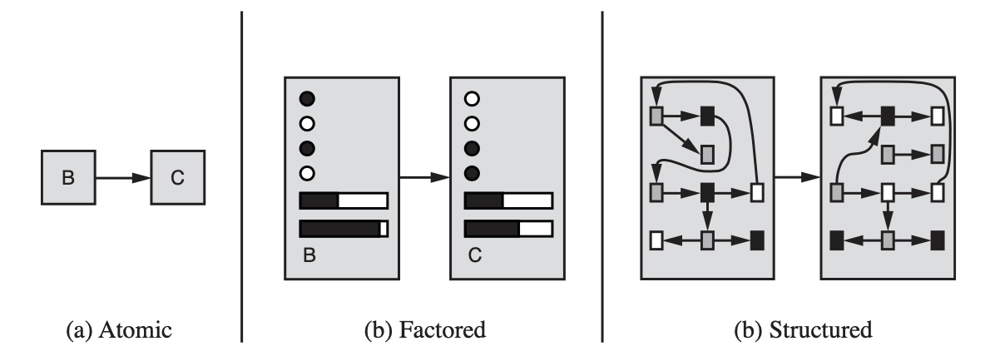

# Representations

Ways to represent states and transitions between the states

- Atomic representation
    
    Everything is abstracted into states eg. State B and State C.
    
    Algorithms that work with atomic-level of representations: search, Markov decision process, game theory, HMM
    
- Factored representation
    
    Every state is a vector or a set of attribute-value pairs. State variables are often called **fluents**.
    
    Algorithms that deal with factored representations: classical planning, machine learning
    
- Structured representation
    
    ???
