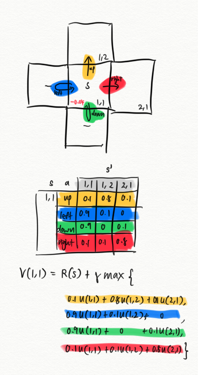

# Value iteration

$$
O(|\mathbb{S} \times \mathbb{A}|)
$$

Solutions to MDP can be found using dynamic programming by looking at the value function. Bellman update (notice the additional thing is just the max):

$$
V(s) = R(s) + \gamma \max_{a \in A} \sum_{s'} P(s'|s,a) V(s')
$$

We iterate this for all the states.

> 💡 Update a state based on its own utility *and* the highest expected utility of its neighbours (discounted).

> ⚠️ Updating a set of values in value iteration is the same as updating a set of weights in gradient descent. You use the current iteration’s value, not the updated values from the current iteration.

- Click here for example
    
    
    

> ⚠️ Value iteration might not be ideal if there are too many states.
