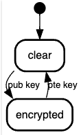

# Asymmetric keys

aka "public key cryptography"

Usages




*Either of the keys can be used to encrypt a message*; the opposite key from the one used to encrypt the message is used for decryption.

# RSA

Rivest-Shamir-Adleman; 1995

Keywords: modular exponentiation, prime factorisation

## Algorithm

$n$ = 1024, 2048, 3072, 4096, 8129, 16384, ... . Key length of 3072-bits considered secure

Find three very large integers e, d and n such that

$$
m^ed = m (\bmod n) \forall m \in [0,n)
$$

- modulus: $n$
- private key: ($n$, $d$)
- public key: ($n$, $e$)
- message: $m$
- cipher: $c$
- exponent / public exponent: $e$
- secret exponent: $d$

Generate

1. Choose 2 primes such that the product $pq$ is of the required bit length.
    
    $p=3, q=11$
    
2. Compute $n$ and $\phi$.
    
    $$
    n = pq = 33
    $$
    
    $$
    \phi= (p-1)(q-1)=20
    $$
    
3. Choose $e$ such that
    1. $1 < e < \phi$
    2. $e$ and $\phi$ are co-prime.
    
    <aside>
    💡 14 and 21 are not coprime because gcd(14, 21) ≠ 1
    
    </aside>
    
    <aside>
    ⚠️ $e$ is usually chosen to be 65,537 (0x10001)
    
    </aside>
    
    $$
    e = 7
    $$
    
    This is your public key.
    
4. Solve $d$ such that
    1. $1 < d < \phi$
    2. $(d \times e) \bmod \phi =1$
        
        <aside>
        💡 This is where the magic happens!
        
        </aside>
        
        [Number theory](https://www.notion.so/Number-theory-3c7b334d25b74651b224c4998d3697f9)
        
    
    This is your private key.
    

Encrypt and decrypt

1. Compute cipher, $c$, of plaintext message $m$
    
    $$
    c = m^e \bmod n = 29
    $$
    
2. Compute plaintext message $m$ of cipher $c$
    
    $$
    m = c^d \bmod n = (m^e \bmod n)^d \bmod n
    $$
    

## Overview

Encrypt:

```
encryptedMsg = m^e mod n
```

Decrypt:

```
msg = encryptedMsg^d mod n
```

```bash
openssl genrsa -out private.key 2048
```

using `nimbusds` module

```kotlin
val keyPair = RSAKeyGenerator(2048).generate()

keyPair.toRSAPublicKey()

Base64.getEncoder().encodeToString(keyPair.toRSAPublicKey().encoded))
Base64.getMimeEncoder(64, "\n".toByteArray()).encodeToString(keyPair.toRSAPrivateKey().encoded)) // todel
```

using `[java.security](http://java.security)` module

```kotlin
val keyPairGenerator = KeyPairGenerator.getInstance("RSA").apply {
    initialize(2048)
}
val keyPair = keyPairGenerator.generateKeyPair()

keyPair.public

println(Base64.getEncoder().encodeToString(keyPair.public.encoded))
println(Base64.getEncoder().encodeToString(keyPair.private.encoded))
```

# EC

Elliptic Curve

Keywords: elliptic curve, discrete logarithm problem

<aside>
💡 Used in Bitcoin, Tor

</aside>

# ECC

(elliptic-curve cryptography)

modern, smaller, faster, more efficient

[https://blog.boot.dev/cryptography/elliptic-curve-cryptography/](https://blog.boot.dev/cryptography/elliptic-curve-cryptography/)
