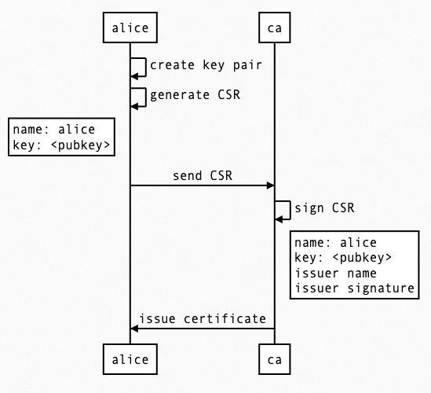

# Digital certificate


[http://www.cs.toronto.edu/~arnold/427/19s/427_19S/tool/ssl/notes.pdf](http://www.cs.toronto.edu/~arnold/427/19s/427_19S/tool/ssl/notes.pdf)



[https://superuser.com/questions/620121/what-is-the-difference-between-a-certificate-and-a-key-with-respect-to-ssl](https://superuser.com/questions/620121/what-is-the-difference-between-a-certificate-and-a-key-with-respect-to-ssl)

A certificate contains

- public key
- name of the issuer etc.

A certificate is signed by a certificate authority (**CA**) using the CA's private key (other people like browsers usually already have their public keys).

The CA is a trusted 3rd party that:

- Issues certificates
- Confirms identity of the certificate owners
- Provides proof that the certificate is valid

Examples of CAs include Let's Encrypt, Comodo and Symantec. Some large cloud computing companies (eg. AWS, Cloudflare, GCP) are also publicly trusted CAs that issue certificates for services hosted on their infrastructure.


Signed certificates can be used for different security protocols:

- HTTPS
- SSH

## Cert

1. Generate a private key:

    ```
    openssl genpkey -algorithm RSA -out private_key.key -aes256
    ```

2. Generate a certificate signing request (CSR):

    ```
    openssl req -new -key private_key.key -out certificate.csr
    ```

3. Generate a self-signed certificate:

    ```
    openssl x509 -req -days 365 -in certificate.csr -signkey private_key.key -out certificate.crt
    ```

## HTTPS and the browser

Nearly every modern browser checks that a server certificate is issued by a trust certificate authority. If the browser detects that the server certificate is self-signed or not signed by an approved trusted certificate authority then visitors will receive a. Warning that the server certificate cannot be trusted.

To get the certificate from a server,

```
openssl s_client -showcerts -servername stackoverflow.com -connect stackoverflow.com:443 </dev/null
```

Based on [this](https://stackoverflow.com/questions/7885785/using-openssl-to-get-the-certificate-from-a-server) StackOverflow post.

new cert (new private key etc.)

```bash
openssl req -newkey rsa:2048 -nodes -keyout domain.key -x509 -days 365 -out domain.crt
```
