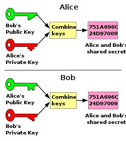

# Key exchange

# Key agreement

Both parties contribute to the negotiation of the shared secret

## DHKE (Diffie-Hellman)



## ECDH (Elliptic-curve Diffie-Hellman)

# Key transport

Typically implemented through public-key

- Code
    
    ```kotlin
    note over alice: file.txt
    alice->alice: create\n key pair
    note over alice: pubkey\nptekey\n file.txt
    note over bob: cert\n bob pubkey\n bob ptekey
    bob-->alice: i want to see ur secrets ;)
    bob->alice: cert
    alice->alice: extract\n pub key
    note over alice: bob pubkey\n pubkey\nptekey\n file.txt
    alice->alice: create\n symkey.pem\n with bob pubkey
    note over alice: symkey.pem\n bob pubkey\n pubkey\nptekey\n file.txt
    alice->alice: encrypt\n symkey.pem
    note over alice: symkey.enc\n symkey.pem\n bob pubkey\n pubkey\nptekey\n file.txt
    alice->alice: generate\n signature
    note over alice: signature\n symkey.enc\n symkey.pem\n bob pubkey\n pubkey\nptekey\n file.txt
    alice->bob: symkey.enc + signature
    note over bob: symkey.enc\n bob pubkey\n bob ptekey
    bob->bob: decrypt\n symkey.enc\n with ptekey
    note over bob: symkey.pem\n symkey.enc\n bob pubkey\n bob ptekey
    bob->bob: compare\n with signature 
    bob-->alice: alls good,\n let's use\n this key from now 
    alice->alice: encrypt\n file.txt\n with symkey.pem
    note over alice: file.enc\n signature\n symkey.enc\n symkey.pem\n bob pubkey\n pubkey\nptekey\n file.txt
    alice->bob: file.enc
    note over bob: file.enc\nsymkey.pem\n symkey.enc\n bob pubkey\n bob ptekey
    bob->bob: decrypt\n file.enc\n with symkey.pem
    note over bob: file.txt\n file.enc\nsymkey.pem\n symkey.enc\n bob pubkey\n bob ptekey
    ```
