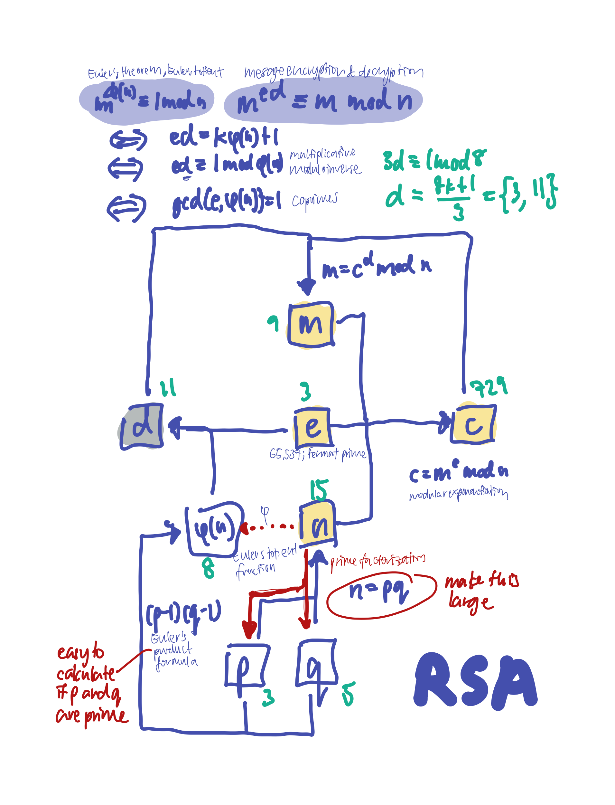

# RSA

[RFC 8017](https://datatracker.ietf.org/doc/html/rfc8017)

Rivest-Shamir-Adleman; 1995; 1st-gen cryptosystem.

Breaking RSA is an _integer factorisation_ problem.

RSA is an algorithm that generates public-private keys. You need to specify the length of the modulus $n$: one of 1024, 2048, 3072, 4096, 8192, 16,384 bits. NIST recommends 2048 [here](https://nvlpubs.nist.gov/nistpubs/SpecialPublications/NIST.SP.800-57Pt3r1.pdf).

For PKCS1 v1.5, the message to encrypt should be **no longer than the public modulus minus 11 bytes**. [http://golang.org/pkg/crypto/rsa/#EncryptPKCS1v15](http://golang.org/pkg/crypto/rsa/#EncryptPKCS1v15).

- secret exponent: $d $
- key exponent: $e $
- modulus: $n$
- message: $m $
- cipher: $c $

$$
(n, e, d)
$$

## Important concepts

* Modular arithmetic
* [Euler's theorem](https://en.wikipedia.org/wiki/Euler%27s_theorem)
* Prime numbers and co-primes
* Prime factorisation
* Euler's totient function
* Multiplicative modulo inverse
* Chinese remainder theorem

## Trapdoor function(s)

* Product of two large prime numbers

$$
n = pq
$$

* Euler's totient function, $\phi(n)$.

## Main idea

$$
m = (m^{ed}) \bmod n
$$

```admonish note
While the encryption-decryption symmetry exists between $e$ and $d$, this symmetry does not extend to most cryptosystems.
```

## How it works



```admonish tip title="Homomorphism"
RSA is multiplicative homomorphic, i.e.

$$
E(m_1) \times E(m_2) = m_1^e \times m_2^e = (m_1 \times m_2)^e=E(m_1\times m_2)
$$
```

## Resources

* [RSA paper](https://people.csail.mit.edu/rivest/Rsapaper.pdf)
* [RSA Algorithm](https://leimao.github.io/article/RSA-Algorithm/)
* [Speeding up modular exponentiation using CRT](https://exploringnumbertheory.wordpress.com/2015/11/16/speeding-up-modular-exponentiation-using-crt/)
