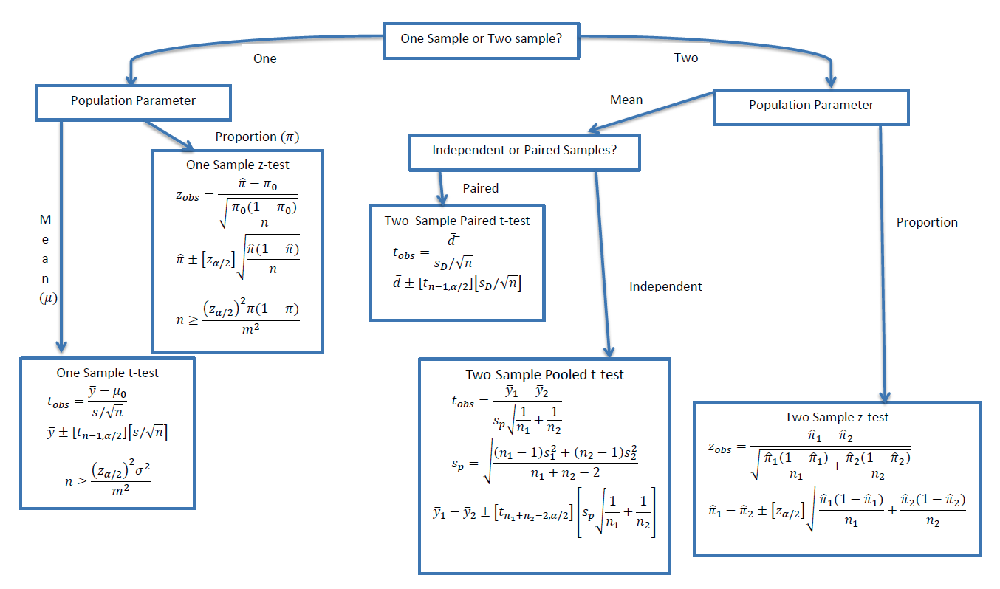

# Statistical tests

<!-- toc -->

---

## Chi-squared test

Aliases: Pearson's chi-squared test, goodness-of-fit statistic

Test if 2 categorical variables are independent

[https://towardsdatascience.com/chi-squared-test-for-feature-selection-with-implementation-in-python-65b4ae7696db](https://towardsdatascience.com/chi-squared-test-for-feature-selection-with-implementation-in-python-65b4ae7696db)

1. $H_0$: Two variables are independent (do they have to follow any distribution???)

   $H_1$: Two variables are not independent

2. Create contingency table

   |              | Cricket | Football | Tennis | Row Total |
   | ------------ | ------- | -------- | ------ | --------- |
   | Male         | 20      | 30       | 15     | 65        |
   | Female       | 20      | 15       | 30     | 65        |
   | Column total | 40      | 45       | 45     | 130       |

3. Calculate expected frequency count for each cell

   ```python
   expected = (row_total * col_total) / grand_total
   ```

   |              | Cricket | Football  | Tennis    | Row Total |
   | ------------ | ------- | --------- | --------- | --------- |
   | Male         | 20 [20] | 30 [22.5] | 15 [22.5] | 65        |
   | Female       | 20 [20] | 15 [22.5] | 30 [22.5] | 65        |
   | Column total | 40      | 45        | 45        | 130       |

4. Calculate chi-square value

   $$
   \chi^2=\sum_{i=1}^{N} \frac{(O_i-E_i)^2}{E_i}
   $$

   $$
   \chi^2 = \frac{(20-20)^2}{20} + \frac{(30-22.5)^2}{22.5} + ...
   $$

   > 💡 Recall that the $\chi^2$ distribution is the sum of squared independent normal random variables.

5. Calculate degrees of freedom

   df = (total_rows - 1) \* (total_cols - 1)

6. Finally, calculate the p-value

## 1-sample, 2-sample



## ANOVA (Analysis of Variance)

to test whether groups of data have the same mean

compares the sum of square error within and between groups.

- The populations from which the samples were obtained must be normally or approximately normally distributed.
- The samples must be independent.
- The variances of the populations must be equal.

Null hypothesis: all population means are equal.

F statistic = SST/(k-1) / SSE/(n-k)

| Quantity            |       | Degrees of Freedom | Distribution |
| ------------------- | ----- | ------------------ | ------------ |
| SS (between groups) | ŷ - ȳ | k-1                |              |
| SS (within)         | y - ŷ | n-k                |              |
| SST                 | y - ȳ | n-1                |              |

## P-Value (Hypothesis testing)

quantifying a proof by contradiction argument, where we begin by assuming the null hypothesis is true

the probability that you would observe something extreme or more than what you had actually observed

It is the chance of observing your sample results or more extreme results assuming that the null hypothesis is true. If this chance is ‘small’, we may reject the null hypothesis.

Samplemean = 0.7

P(X_bar > claim) = p

has underlying assumption\*

monotonic = never increases OR never decreases

A distribution is the arrangement of data by the values of one variable in order, from low to high. This arrangement, and its characteristics such as shape and spread, provide information about the underlying sample.
