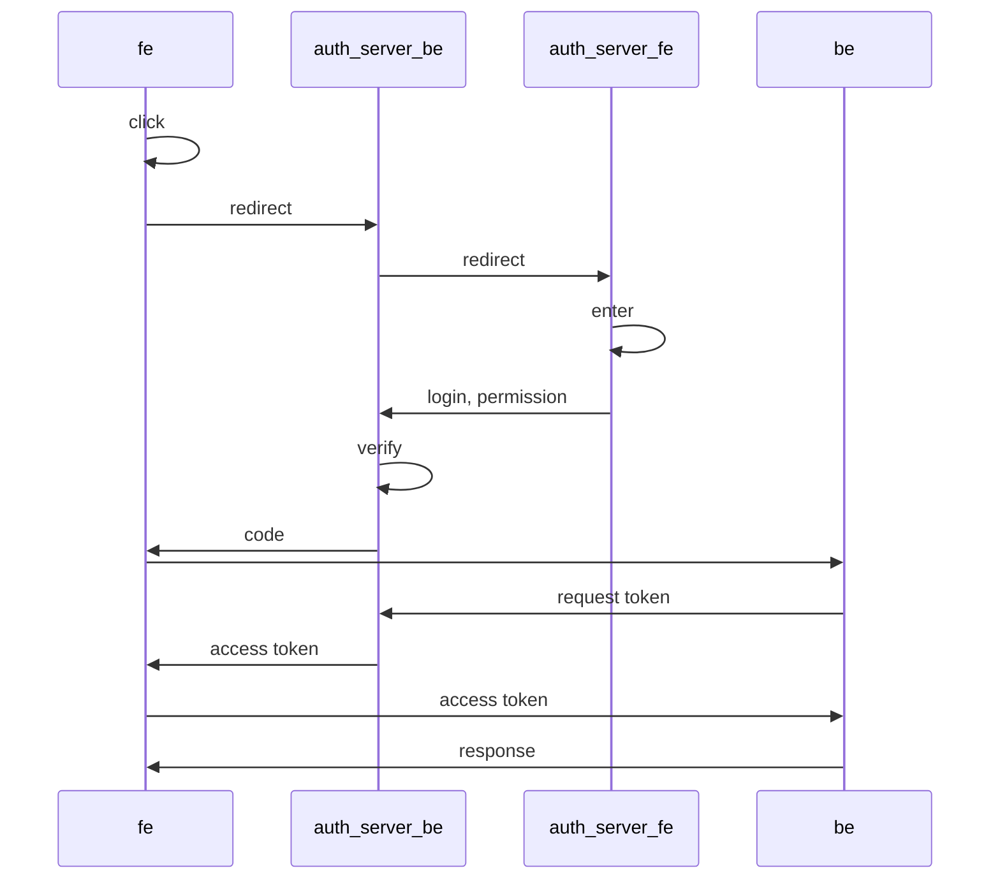

# Authorization Code Flow

```mermaid
sequenceDiagram
   fe ->> fe: click
   fe ->> auth_server_be: redirect
   auth_server_be ->> auth_server_fe: redirect
   auth_server_fe ->> auth_server_fe: enter 
   auth_server_fe ->> auth_server_be: login, permission
   auth_server_be ->> auth_server_be: verify
   auth_server_be ->> fe: code
   fe ->> be: 
   be ->> auth_server_be: request token
   auth_server_be ->> fe: access token
   fe ->> be: access token
   be ->> fe: response
```
