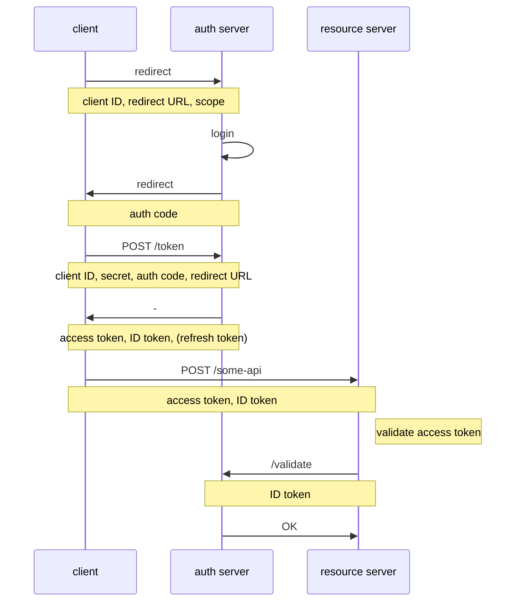

# Authorization Code Flow

```mermaid
sequenceDiagram
   client ->> auth server: redirect
   Note over client,auth server: client ID, redirect URL, scope

   auth server ->> auth server: login

   auth server ->> client: redirect
   Note over client,auth server: auth code

   client ->> auth server: POST /token
   Note over client,auth server: client ID, secret, auth code, redirect URL

   auth server ->> client: -
   Note over client,auth server: access token, ID token, (refresh token)

   client ->> resource server: POST /some-api
   Note over client,resource server: access token, ID token

   Note right of resource server: validate access token

   resource server ->> auth server: /validate
   Note over auth server,resource server: ID token

   auth server ->> resource server: OK
```
