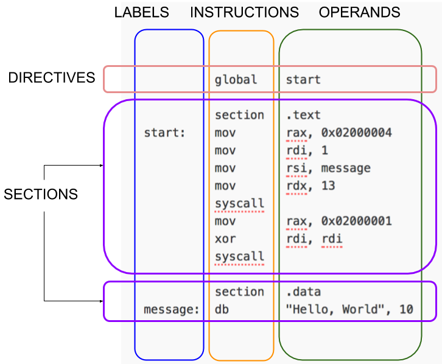

# Anatomy of assembly program

- Text section: program
- Data section: declare constants and data which won’t change at runtime.
- Bss section: for variables not yet declared

Assembly statements
⁃	executable instructions/ instructions: tell the processor what to do. Each instruction generates one machine language instruction
⁃	assembler directives or pseudo-ops
⁃	macros: text substitution mechanism

